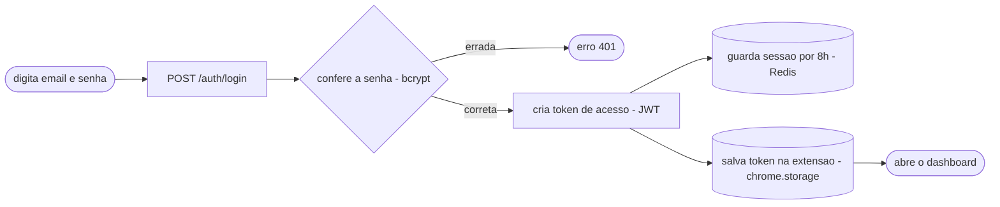
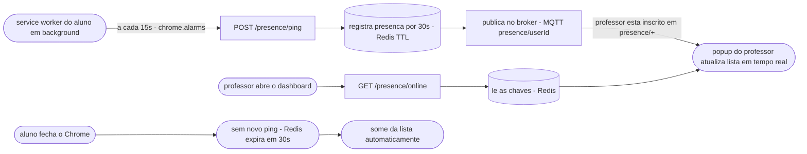
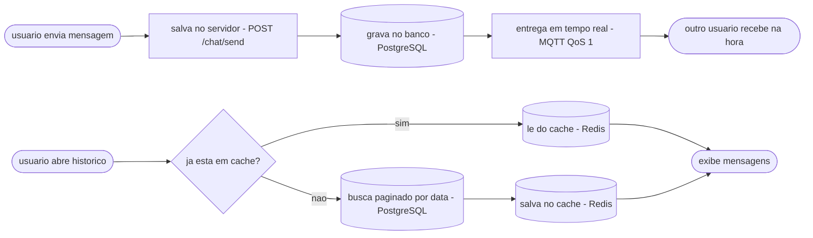
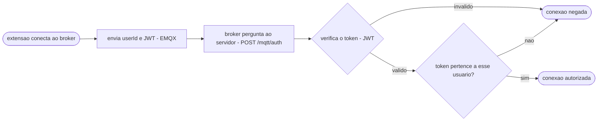
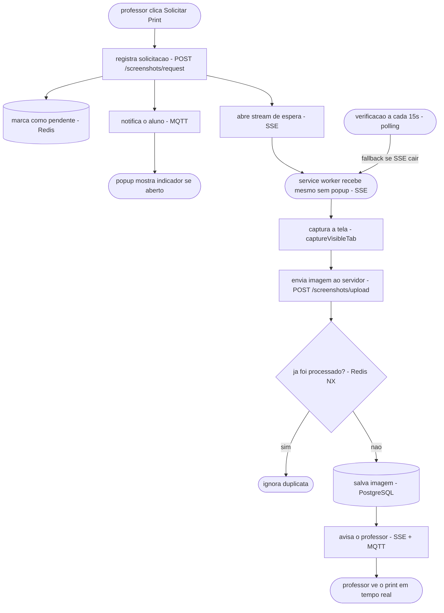
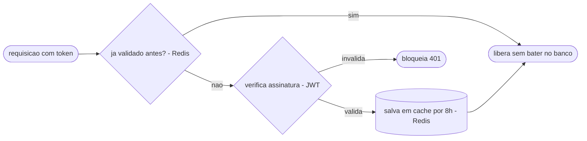

# Fluxos Técnicos — OctoClass

---

## Login

```mermaid
graph LR
    A([digita email e senha]) --> B[POST /auth/login]
    B --> C{confere a senha - bcrypt}
    C -->|errada| D([erro 401])
    C -->|correta| E[cria token de acesso - JWT]
    E --> F[(guarda sessao por 8h - Redis)]
    E --> G[(salva token na extensao - chrome.storage)]
    G --> H([abre o dashboard])
```

---

## Presenca Online

```mermaid
graph LR
    A([service worker do aluno em background]) -->|a cada 15s - chrome.alarms| B[POST /presence/ping]
    B --> C[(registra presenca por 30s - Redis TTL)]
    C --> D[publica no broker - MQTT presence/userId]
    D -->|professor esta inscrito em presence/+| E([popup do professor atualiza lista em tempo real])
    F([professor abre o dashboard]) --> G[GET /presence/online]
    G --> H[(le as chaves - Redis)]
    H --> E
    I([aluno fecha o Chrome]) --> J([sem novo ping - Redis expira em 30s])
    J --> K([some da lista automaticamente])
```

---

## Chat

```mermaid
graph LR
    A([usuario envia mensagem]) --> B[salva no servidor - POST /chat/send]
    B --> C[(grava no banco - PostgreSQL)]
    C --> D[entrega em tempo real - MQTT QoS 1]
    D --> E([outro usuario recebe na hora])
    F([usuario abre historico]) --> G{ja esta em cache?}
    G -->|sim| H[(le do cache - Redis)]
    G -->|nao| I[(busca paginado por data - PostgreSQL)]
    I --> J[(salva no cache - Redis)]
    H --> K([exibe mensagens])
    J --> K
```

---

## Autenticacao MQTT

```mermaid
graph LR
    A([extensao conecta ao broker]) --> B[envia userId e JWT - EMQX]
    B --> C[broker pergunta ao servidor - POST /mqtt/auth]
    C --> D{verifica o token - JWT}
    D -->|invalido| E([conexao negada])
    D -->|valido| F{token pertence a esse usuario?}
    F -->|nao| E
    F -->|sim| G([conexao autorizada])
```

---

## Screenshot

```mermaid
graph TD
    A([professor clica Solicitar Print]) --> B[registra solicitacao - POST /screenshots/request]
    B --> C[(marca como pendente - Redis)]
    B --> D[notifica o aluno - MQTT]
    B --> E[abre stream de espera - SSE]
    D --> F([popup mostra indicador se aberto])
    E --> G([service worker recebe mesmo sem popup - SSE])
    H([verificacao a cada 15s - polling]) -->|fallback se SSE cair| G
    G --> I[captura a tela - captureVisibleTab]
    I --> J[envia imagem ao servidor - POST /screenshots/upload]
    J --> K{ja foi processado? - Redis NX}
    K -->|sim| L([ignora duplicata])
    K -->|nao| M[(salva imagem - PostgreSQL)]
    M --> N[avisa o professor - SSE + MQTT]
    N --> O([professor ve o print em tempo real])
```

---

## Validacao do Token

```mermaid
graph LR
    A([requisicao com token]) --> B{ja validado antes? - Redis}
    B -->|sim| C([libera sem bater no banco])
    B -->|nao| D{verifica assinatura - JWT}
    D -->|invalida| E([bloqueia 401])
    D -->|valida| F[(salva em cache por 8h - Redis)]
    F --> C
```
